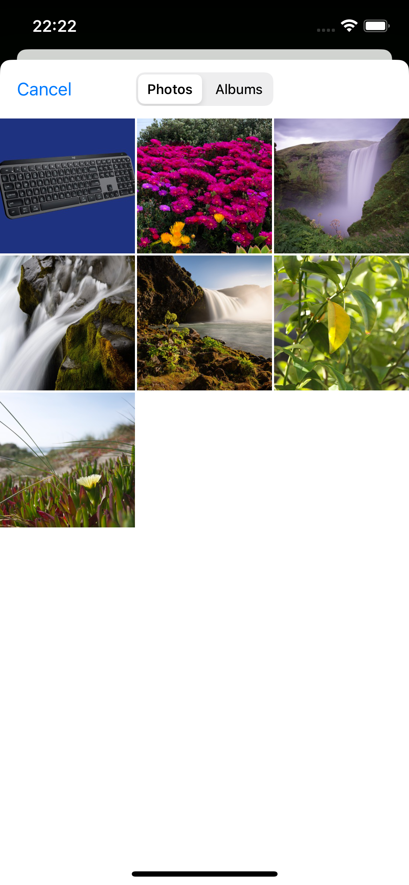
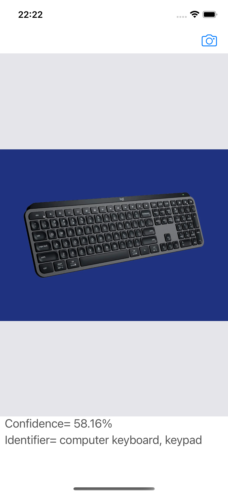

Object ML
==========================
This is an application that uses a Machine Learning model to recognize objects that have been photographed or selected from photo library

## Screenshots
  


## Features
* CoreML
* UI Image Picker Controller
* UIKit


## How to build

1) Clone the repository

```bash
https://github.com/GorganMihai/News-App.git
```

# Requirements 

* Xcode 13
* iOS 15.5
* Swift 5
